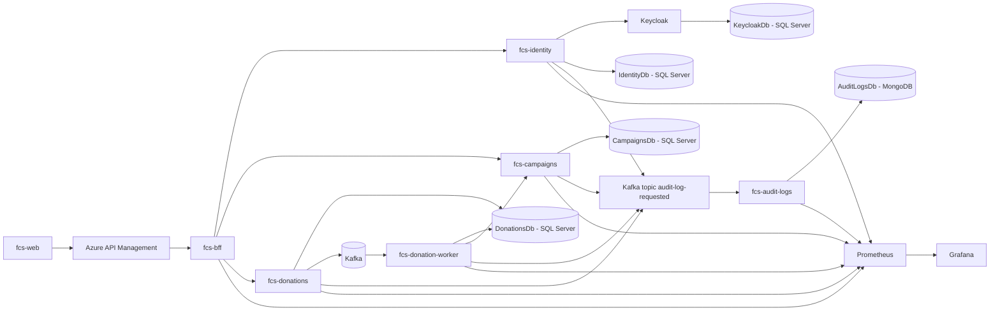

# Conexão Solidária - Documentação da Entrega

Este documento consolida como a plataforma **Conexão Solidária** atende aos critérios do hackathon descritos em [hackaton.md](./hackaton.md). Ele funciona como índice da documentação da Fase 05 e como checklist de rastreabilidade entre requisito, decisão arquitetural e componente responsável.

## 1. Visão geral

A plataforma atende a ONG **Esperança Solidária** com um MVP para cadastro de doadores, autenticação, gestão de campanhas, painel público de transparência e processamento assíncrono de doações.

Objetivos técnicos da entrega:

- Escalar por microsserviços independentes.
- Proteger acesso com JWT e RBAC.
- Processar doações de forma assíncrona via Kafka.
- Rodar localmente em Kubernetes com Kind.
- Expor métricas reais para Prometheus e Grafana.
- Automatizar build, testes, segurança e imagem Docker com GitHub Actions.
- Preparar a infraestrutura Azure com AKS, ACR, Key Vault, API Management e Terraform.

Aplicações e repositórios:

| Repositório           | Responsabilidade                                                                                               |
| --------------------- | -------------------------------------------------------------------------------------------------------------- |
| `fcs-identity`        | Identidade, autenticação, refresh token, cadastro de Doador, provisionamento de GestorONG e perfis de domínio. |
| `fcs-campaigns`       | Gestão de campanhas, painel público de transparência e atualização idempotente do valor arrecadado.            |
| `fcs-donations`       | Recebimento de intenções de doação e publicação de eventos de doação.                                          |
| `fcs-donation-worker` | Consumo de eventos de doação, processamento e atualização do status da doação.                                 |
| `fcs-audit-logs`      | Consumo de eventos explícitos de auditoria e persistência em MongoDB.                                          |
| `fcs-bff`             | Backend for Frontend da plataforma, agregando e adaptando contratos para o `fcs-web`.                          |
| `fcs-web`             | Interface web da plataforma.                                                                                   |
| `fcs-infra`           | Ambiente integrado, Kubernetes, observabilidade, Keycloak, Kafka, MongoDB e Terraform Azure.                   |
| `fcs-pipelines`       | Workflows reutilizáveis de CI/CD consumidos pelos repositórios da plataforma.                                  |

## 2. Como subir localmente

O ambiente integrado deve ser executado pelo repositório `fcs-infra`, que concentra os componentes compartilhados e os manifests Kubernetes integrados.

Passo a passo esperado:

1. Clonar todos os repositórios da Fase 05.
2. Entrar no repositório `fcs-infra`.
3. Subir o cluster local com Kind.
4. Aplicar os manifests de infraestrutura compartilhada:
   - Keycloak
   - Kafka
   - Kafka UI
   - MongoDB
   - Prometheus
   - Grafana
5. Aplicar os manifests das aplicações:
   - `fcs-identity`
   - `fcs-campaigns`
   - `fcs-donations`
   - `fcs-donation-worker`
   - `fcs-audit-logs`
   - `fcs-bff`
   - `fcs-web`
6. Validar os pods:

```bash
kubectl get pods --all-namespaces
```

7. Acessar os endpoints públicos via API Management no Azure ou via port-forward/ingress no ambiente local.
8. Acessar Grafana para acompanhar métricas reais dos pods e das requisições.
9. Acessar Kafka UI para demonstrar os tópicos `donation-received` e `audit-log-requested`.

Cada aplicação também deve manter seu próprio README com instruções específicas de build, testes, Docker e variáveis locais.

## 3. Critérios funcionais obrigatórios

### 3.1 Autenticação e autorização com JWT e RBAC

Atendido por:

- `fcs-identity`
- Keycloak
- APIs protegidas por JWT

Como será atendido:

- O Keycloak emite os tokens JWT.
- O cliente não chama o Keycloak diretamente; ele usa a fachada `fcs-identity`.
- As roles canônicas são `GestorONG` e `Doador`.
- Endpoints administrativos são protegidos por role `GestorONG`.
- Endpoints de doação são protegidos por role `Doador`.
- As APIs validam JWT e RBAC internamente.

Endpoints principais:

```text
POST /api/v1/auth/register/donor
POST /api/v1/auth/login
POST /api/v1/auth/refresh
GET  /api/v1/me
```

Referências:

- [Modelo da identidade](./architecture/fcs-identity-model.md)
- [Endpoints](./architecture/endpoints.md)
- [ADR 0001 - Keycloak atrás da Identity API](./adr/0001-keycloak-behind-identity-api.md)

### 3.2 Gestão de campanhas

Atendido por:

- `fcs-campaigns`

Como será atendido:

- Apenas `GestorONG` pode criar, editar, concluir ou cancelar campanhas.
- Toda campanha nova nasce com status `Active`.
- Apenas campanhas `Active` podem ser editadas.
- Status aceitos no domínio:
  - `Active`
  - `Completed`
  - `Canceled`
- O status documentado no enunciado (`Ativa`, `Concluida`, `Cancelada`) é representado em código em inglês para manter padrão técnico dos serviços.

Campos obrigatórios:

| Enunciado      | Implementação   |
| -------------- | --------------- |
| Título         | `Title`         |
| Descrição      | `Description`   |
| DataInicio     | `StartDate`     |
| DataFim        | `EndDate`       |
| MetaFinanceira | `FinancialGoal` |
| Status         | `Status`        |

Regras:

- `FinancialGoal` deve ser maior que zero.
- `EndDate` não pode estar no passado ao criar ou editar.
- Transições permitidas:
  - `Active -> Completed`
  - `Active -> Canceled`
- Transições bloqueadas:
  - `Completed -> Active`
  - `Canceled -> Active`
  - `Completed -> Canceled`
  - `Canceled -> Completed`

Referências:

- [Modelo de campanhas](./architecture/fcs-campaigns-model.md)
- [Endpoints](./architecture/endpoints.md)
- [ADR 0005 - Campanhas e transparência](./adr/0005-campaigns-own-campaign-management-and-transparency.md)

### 3.3 Cadastro de Doador

Atendido por:

- `fcs-identity`
- Keycloak
- `IdentityDb`

Como será atendido:

- O cadastro do Doador é público.
- A senha não é persistida nas tabelas da aplicação.
- Credenciais, hash de senha e autenticação ficam no Keycloak.
- O perfil de domínio fica em `DonorProfiles`, no `IdentityDb`.
- Email e CPF são únicos.
- CPF é validado e armazenado como dado do perfil de domínio.

Campos:

| Enunciado     | Implementação                                           |
| ------------- | ------------------------------------------------------- |
| Nome Completo | `FullName`                                              |
| Email         | `Email`, único                                          |
| CPF           | `Cpf`, único e validado                                 |
| Senha         | Enviada ao Keycloak e armazenada pelo provedor com hash |

Referências:

- [Modelo da identidade](./architecture/fcs-identity-model.md)
- [Modelo de banco de dados](./architecture/database-model.md)
- [ADR 0004 - Cadastro de Doador pela Identity API](./adr/0004-register-doador-through-identity-api.md)

### 3.4 Painel de Transparência

Atendido por:

- `fcs-campaigns`
- `fcs-bff`
- `fcs-web`

Como será atendido:

- O endpoint público lista apenas campanhas com status `Active`.
- O painel retorna título, meta financeira e valor total arrecadado.
- O valor arrecadado vem da agregação de doações processadas e refletidas pelo worker, não da intenção inicial.

Endpoint:

```text
GET /api/v1/transparency/campaigns
```

Dados retornados:

| Enunciado              | Implementação       |
| ---------------------- | ------------------- |
| Título                 | `title`             |
| Meta Financeira        | `financialGoal`     |
| Valor Total Arrecadado | `totalAmountRaised` |

Referências:

- [Endpoints](./architecture/endpoints.md)
- [Modelo de campanhas](./architecture/fcs-campaigns-model.md)

### 3.5 Processo de doação

Atendido por:

- `fcs-donations`
- `fcs-donation-worker`
- `fcs-campaigns`
- Kafka

Como será atendido:

- Apenas `Doador` autenticado pode enviar intenção de doação.
- A intenção contém `campaignId` e `amount`.
- A `fcs-donations` consulta a `fcs-campaigns` para validar se a campanha está apta a receber doação.
- Não é permitido doar para campanha `Completed` ou `Canceled`.
- A doação aceita nasce como `Pending`.
- A API registra a doação e uma mensagem na outbox.
- O valor arrecadado não é atualizado diretamente pela API de doações.
- O worker consome o evento e reflete o valor na campanha por endpoint interno.

Endpoint público:

```text
POST /api/v1/donations
```

Endpoints internos:

```text
GET  /internal/campaigns/{id}/donation-eligibility
POST /internal/campaigns/{id}/donation-processed
```

Referências:

- [Fluxo de doações](./architecture/fcs-donations-flow.md)
- [Fluxos de endpoints](./architecture/endpoint-flows.md)
- [ADR 0006 - API de doações recebe intenções](./adr/0006-donations-api-receives-donation-intentions.md)
- [ADR 0007 - Elegibilidade de campanha via HTTP](./adr/0007-validate-campaign-eligibility-over-http.md)

## 4. Critérios técnicos obrigatórios

### 4.1 Arquitetura de microsserviços

Atendido por:

- `fcs-identity`
- `fcs-campaigns`
- `fcs-donations`
- `fcs-donation-worker`
- `fcs-audit-logs`
- `fcs-bff`
- `fcs-web`
- `fcs-infra`

Como será atendido:

- A plataforma tem mais de dois microsserviços, superando o mínimo exigido.
- Cada serviço tem responsabilidade própria e banco de dados próprio quando aplicável.
- Não há foreign keys entre bancos de serviços diferentes.
- Comunicação síncrona entre serviços ocorre por endpoints internos privados.
- Comunicação assíncrona ocorre por Kafka.

Referências:

- [Overview da arquitetura](./architecture/overview.md)
- [Repositórios e infraestrutura](./architecture/repositories-and-infra.md)
- [ADR 0002 - Fronteiras de serviço](./adr/0002-service-boundaries-for-campaigns-and-donations.md)
- [ADR 0013 - Repositórios separados](./adr/0013-use-separate-repositories.md)

### 4.2 Comunicação assíncrona com mensageria

Atendido por:

- Kafka
- `fcs-donations`
- `fcs-donation-worker`
- `fcs-campaigns`

Fluxo obrigatório do enunciado:

```text
Cliente -> API -> Broker -> Worker -> atualização da campanha
```

Fluxo na arquitetura:

```text
Doador -> fcs-donations -> Kafka topic donation-received -> fcs-donation-worker -> fcs-campaigns
```

Evento:

```text
Topic: donation-received
Event: DonationReceivedEvent
```

Como será atendido:

- A API de doações não atualiza o valor arrecadado diretamente.
- A API persiste a doação como `Pending`.
- A API registra `OutboxMessage`.
- O publisher da outbox publica `DonationReceivedEvent`.
- O worker consome o evento.
- O worker chama endpoint interno da `fcs-campaigns`.
- A `fcs-campaigns` atualiza `TotalAmountRaised` de forma idempotente.

Referências:

- [Fluxo de doações](./architecture/fcs-donations-flow.md)
- [ADR 0008 - Kafka para eventos de doação](./adr/0008-use-kafka-for-donation-events.md)
- [ADR 0009 - Worker atualiza status da doação](./adr/0009-worker-updates-donation-status.md)
- [ADR 0010 - Worker atualiza campanhas via API interna](./adr/0010-worker-updates-campaigns-through-internal-api.md)

### 4.3 Orquestração com Kubernetes

Atendido por:

- `fcs-infra`
- manifests de cada aplicação
- Kind local
- AKS em Azure

Como será atendido:

- O ambiente local usa Kind.
- O ambiente Azure usa AKS.
- Os manifests incluem `Deployments`, `Services` e `ConfigMaps`.
- Namespaces são separados por aplicação.
- Componentes compartilhados ficam em `fcs-infra`.

Namespaces:

```text
fcs-identity
fcs-campaigns
fcs-donations
fcs-donation-worker
fcs-audit-logs
fcs-infra
```

Referências:

- [Overview da arquitetura](./architecture/overview.md)
- [Repositórios e infraestrutura](./architecture/repositories-and-infra.md)
- [ADR 0014 - AKS como alvo Azure](./adr/0014-use-aks-as-azure-kubernetes-target.md)
- [ADR 0026 - Namespaces separados](./adr/0026-use-separated-kubernetes-namespaces.md)
- [ADR 0029 - Kind local](./adr/0029-use-kind-for-local-kubernetes.md)

### 4.4 Observabilidade com Grafana

Atendido por:

- Prometheus
- Grafana
- OpenTelemetry nos serviços .NET
- endpoints `/health` e `/metrics`

Como será atendido:

- Serviços expõem `/health` para saúde.
- Serviços expõem `/metrics` para Prometheus/OpenTelemetry.
- Prometheus coleta métricas.
- Grafana exibe dashboards com métricas reais.

Métricas mínimas previstas:

- CPU e memória dos pods.
- Quantidade de requisições HTTP.
- Status dos pods.
- Métricas de processamento do worker quando disponíveis.

Observação:

- `/health` e `/metrics` são endpoints operacionais.
- Eles não devem ser publicados no Azure API Management.

Referências:

- [Overview da arquitetura](./architecture/overview.md)
- [ADR 0020 - Prometheus e Grafana no Kubernetes](./adr/0020-run-prometheus-and-grafana-inside-kubernetes.md)
- [ADR 0021 - OpenTelemetry](./adr/0021-use-opentelemetry-for-service-observability.md)

### 4.5 Pipeline de CI/CD

Atendido por:

- `fcs-pipelines`
- wrappers `.github/workflows` em cada repositório

Como será atendido:

- GitHub Actions executa a cada push na branch principal e em pull requests.
- Serviços .NET usam `dotnet-service-ci.yml`.
- Aplicações Angular usam `angular-web-ci.yml`.
- A política de branch usa `branch-name-check.yml`.
- Infraestrutura usa `terraform-azure.yml`.
- Delivery para AKS usa workflows de delivery quando habilitado.

Gates dos serviços .NET:

- Branch policy.
- Secret scan com Gitleaks.
- Dependency vulnerability scan.
- Restore.
- Build.
- Testes.
- Cobertura mínima de 80%.
- SonarCloud quando configurado.
- Docker build validation.
- Build e push da imagem para ACR no CD.
- Trivy scan no CD.

Gates da aplicação Angular:

- Branch policy.
- Secret scan com Gitleaks.
- `npm audit --audit-level=high`.
- Formatação.
- Lint.
- Testes unitários.
- Cobertura mínima de 80%.
- Build Angular.
- Docker build validation.

Critério obrigatório do enunciado:

| Critério                                              | Como será atendido                                            |
| ----------------------------------------------------- | ------------------------------------------------------------- |
| Pipeline automatizado a cada push na branch principal | Workflows GitHub Actions em cada repositório                  |
| Compilar o código                                     | `dotnet build` nos serviços .NET e `npm run build` no Angular |
| Gerar imagem Docker                                   | `docker/build-push-action` nos workflows de CI/CD             |
| Deploy automático no Kubernetes                       | Opcional, disponível nos workflows de delivery                |

Referências:

- [Repositórios e infraestrutura](./architecture/repositories-and-infra.md)
- [ADR 0022 - Reutilizar fcs-pipelines](./adr/0022-reuse-fcs-pipelines-for-ci-cd.md)

## 5. Critérios técnicos opcionais

### 5.1 Testes de unidade na esteira de CI

Atendido por:

- Serviços .NET com testes unitários, incluindo o `fcs-bff`.
- `fcs-audit-logs` com testes unitários.
- `fcs-web` com testes unitários Angular/Vitest.
- Workflows reutilizáveis do `fcs-pipelines`.

Como será atendido:

- Serviços .NET executam `dotnet test`.
- Angular executa `npm run test:ci`.
- Cobertura mínima configurada em 80% quando aplicável.

Referências:

- [ADR 0025 - Estratégia de testes](./adr/0025-test-strategy-for-apis-and-worker.md)

### 5.2 API Gateway

Atendido por:

- Azure API Management

Como será atendido:

- O APIM será a borda pública das APIs no ambiente Azure.
- Ele centraliza rotas públicas e aplica rate limit.
- Validação de JWT e autorização RBAC continuam dentro das APIs.
- Rotas internas, `/health` e `/metrics` não devem ser expostas no APIM.

Referências:

- [Overview da arquitetura](./architecture/overview.md)
- [ADR 0028 - APIM como borda pública](./adr/0028-use-azure-api-management-as-public-edge.md)
- [ADR 0027 - APIs internas privadas](./adr/0027-keep-internal-apis-cluster-private.md)

## 6. Escolha dos bancos de dados

### 6.1 SQL Server

Onde será usado:

| Database      | Dono                                    | Uso                                                  |
| ------------- | --------------------------------------- | ---------------------------------------------------- |
| `IdentityDb`  | `fcs-identity`                          | Perfis de domínio de Doador e GestorONG.             |
| `CampaignsDb` | `fcs-campaigns`                         | Campanhas e doações refletidas por campanha.         |
| `DonationsDb` | `fcs-donations` e `fcs-donation-worker` | Intenções de doação, outbox e mensagens processadas. |
| `KeycloakDb`  | Keycloak                                | Persistência interna do provedor de identidade.      |

Motivos da escolha:

- Os dados operacionais são relacionais e transacionais.
- Campanhas, doações, perfis e outbox precisam de consistência forte.
- O modelo exige constraints, índices, unicidade e transações.
- O SQL Server atende ao requisito de banco relacional com boa integração com .NET e Entity Framework Core.
- Em Azure, a solução pode usar banco SQL gerenciado fora do AKS.
- Cada serviço mantém seu próprio database, evitando acoplamento entre microsserviços.
- Não há foreign keys entre databases de serviços diferentes.

Como será usado:

- Cada serviço .NET mantém suas próprias migrations com Entity Framework Core.
- `fcs-donations` usa Transactional Outbox para garantir publicação confiável de `DonationReceivedEvent`.
- `fcs-campaigns` usa tabela de entradas processadas para refletir doações de forma idempotente.
- `KeycloakDb` é administrado pelo Keycloak; a aplicação não modela suas tabelas internas.

Referências:

- [Modelo de banco de dados](./architecture/database-model.md)
- [ADR 0011 - SQL Server](./adr/0011-use-sql-server-for-service-databases.md)
- [ADR 0012 - Entity Framework Core](./adr/0012-use-entity-framework-core.md)
- [ADR 0016 - Banco SQL gerenciado na Azure](./adr/0016-use-managed-sql-on-azure.md)

### 6.2 MongoDB

Onde será usado:

| Database      | Dono             | Uso                                                       |
| ------------- | ---------------- | --------------------------------------------------------- |
| `AuditLogsDb` | `fcs-audit-logs` | Auditoria centralizada e imutável por eventos explícitos. |

Coleção:

```text
audit_logs
```

Motivos da escolha:

- Auditoria tem formato naturalmente documental.
- O campo `metadata` pode variar por serviço, ação e entidade.
- MongoDB permite armazenar eventos de auditoria com estrutura flexível sem alterar schema relacional a cada novo tipo de evento.
- A auditoria fica separada dos bancos operacionais, reduzindo acoplamento.
- Consultas por `eventId`, `serviceName`, `action`, `entityId`, `actorId` e `correlationId` são atendidas por índices.
- O fluxo é append-oriented e se encaixa bem em documentos.

Como será usado:

- Cada aplicação publica eventos no tópico Kafka `audit-log-requested`.
- O `fcs-audit-logs` consome os eventos.
- O worker aplica idempotência por `eventId`.
- O worker persiste documentos na coleção `audit_logs`.
- Dados sensíveis como senha, token e refresh token não são publicados.

Referências:

- [Modelo de banco de dados](./architecture/database-model.md)
- [ADR 0030 - Auditoria explícita por eventos](./adr/0030-use-explicit-business-audit-logs.md)

## 7. Desenho da arquitetura

Diagrama de alto nível:



O PDF final de arquitetura deve incluir:

- Microsserviços.
- Bancos de dados.
- Kafka.
- Worker.
- Observabilidade com Prometheus e Grafana.
- API Gateway com Azure API Management.
- Kubernetes local com Kind e Azure com AKS.

## 8. Demonstração em vídeo

O vídeo deve ter no máximo 15 minutos e cobrir todos os itens abaixo.

### 8.1 Explicação do diagrama de arquitetura

Mostrar:

- Separação dos microsserviços.
- Bancos por serviço.
- Kafka e worker.
- Auditoria centralizada.
- Prometheus/Grafana.
- APIM como borda pública.

### 8.2 Pipeline de CI

Mostrar:

- GitHub Actions executando.
- Build do código.
- Testes.
- Cobertura.
- Secret scan.
- Dependency scan.
- Docker build validation.
- Geração ou validação da imagem Docker.

### 8.3 Kubernetes e Grafana

Mostrar no terminal:

```bash
kubectl get pods --all-namespaces
```

Mostrar no Grafana:

- Métricas reais dos pods.
- Requisições HTTP.
- Status dos serviços.
- Métricas do worker quando disponíveis.

### 8.4 Demonstração funcional

Fluxo obrigatório:

1. Autenticar via Swagger/Postman.
2. Obter token JWT.
3. Criar uma campanha como `GestorONG`.
4. Cadastrar ou autenticar um `Doador`.
5. Enviar uma intenção de doação.
6. Mostrar Kafka UI com a mensagem no tópico `donation-received`.
7. Mostrar o worker processando a mensagem.
8. Consultar o painel público de transparência.
9. Comprovar que o valor arrecadado foi atualizado pelo worker.

## 9. Relatório de entrega

O relatório final em PDF ou TXT deve conter:

| Item exigido           | Onde preencher                             |
| ---------------------- | ------------------------------------------ |
| Nome do grupo          | Relatório final de entrega                 |
| Participantes          | Relatório final de entrega                 |
| Usernames no Discord   | Relatório final de entrega                 |
| Link da documentação   | Link para este repositório de documentação |
| Links dos repositórios | Lista dos repositórios da Fase 05          |
| Link do vídeo          | URL do YouTube ou similar                  |

## 10. Checklist final dos critérios

| Critério                                             | Status                                                | Onde é atendido                                   |
| ---------------------------------------------------- | ----------------------------------------------------- | ------------------------------------------------- |
| JWT                                                  | Atendido                                              | `fcs-identity` + Keycloak                         |
| RBAC                                                 | Atendido                                              | Roles `GestorONG` e `Doador`                      |
| Endpoints administrativos para GestorONG             | Atendido                                              | `fcs-campaigns`                                   |
| Gestão de campanhas                                  | Atendido                                              | `fcs-campaigns`                                   |
| Cadastro público de Doador                           | Atendido                                              | `fcs-identity`                                    |
| Painel público de transparência                      | Atendido                                              | `fcs-campaigns` + `fcs-bff` + `fcs-web` |
| Doação por Doador logado                             | Atendido                                              | `fcs-donations`                                   |
| Bloqueio de doação para campanha concluída/cancelada | Atendido                                              | `fcs-donations` + `fcs-campaigns`                 |
| Mínimo de dois microsserviços                        | Atendido                                              | Plataforma possui múltiplos serviços              |
| Comunicação assíncrona                               | Atendido                                              | Kafka + `fcs-donation-worker`                     |
| API não atualiza valor arrecadado diretamente        | Atendido                                              | Atualização feita pelo worker via `fcs-campaigns` |
| Kubernetes                                           | Atendido                                              | Kind local e AKS                                  |
| Deployments, Services e ConfigMaps                   | Atendido                                              | `fcs-infra` e manifests das aplicações  |
| `/health` ou `/metrics`                              | Atendido                                              | Serviços .NET                                     |
| Grafana com métricas reais                           | Atendido                                              | Prometheus + Grafana                              |
| Pipeline a cada push na principal                    | Atendido                                              | GitHub Actions via `fcs-pipelines`                |
| Compilar código na pipeline                          | Atendido                                              | `.NET build` e `npm run build`                    |
| Gerar ou validar imagem Docker                       | Atendido                                              | Docker build validation e delivery                |
| Deploy automático no Kubernetes                      | Opcional atendido quando habilitado                   | Workflows de delivery                             |
| Testes unitários na CI                               | Bônus atendido                                        | .NET + Angular/Vitest                             |
| API Gateway                                          | Bônus atendido                                        | Azure API Management                              |
| Repositório público                                  | Deve ser configurado em cada repo                     | GitHub                                            |
| README passo a passo                                 | Atendido por este documento e READMEs dos componentes | `docs/README.md` e READMEs por repo               |
| Diagrama de arquitetura                              | Atendido neste documento e no PDF final               | Seção 7                                           |
| Justificativa dos bancos                             | Atendido                                              | Seção 6                                           |
| Vídeo de demonstração                                | Deve ser gravado                                      | Seção 8                                           |
| Relatório de entrega                                 | Deve ser preenchido                                   | Seção 9                                           |

## 11. Referências principais

- [Hackathon](./hackaton.md)
- [Overview da arquitetura](./architecture/overview.md)
- [Endpoints](./architecture/endpoints.md)
- [Fluxos de endpoints](./architecture/endpoint-flows.md)
- [Modelo de banco de dados](./architecture/database-model.md)
- [Repositórios e infraestrutura](./architecture/repositories-and-infra.md)
- [ADRs](./adr/)
