# Fluxos dos Endpoints

Este documento descreve os fluxos Mermaid dos endpoints confirmados. Os fluxos seguem os contratos definidos em [endpoints.md](./endpoints.md).

## fcg-identity

### POST /api/v1/auth/register/donor

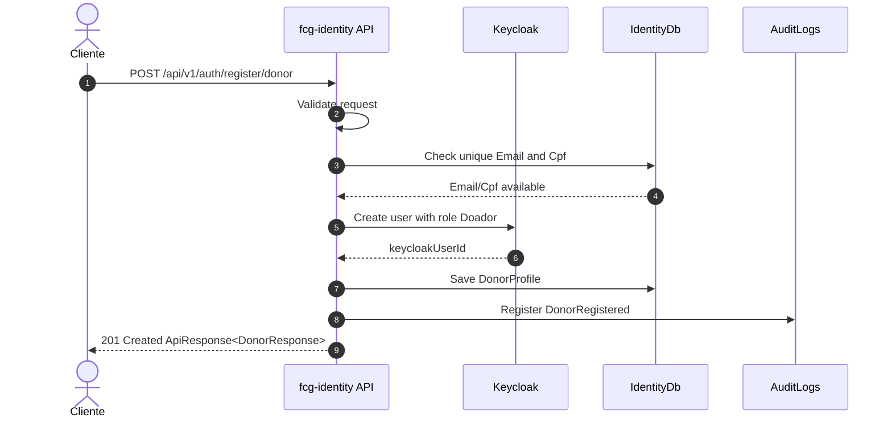
```mermaid
sequenceDiagram
    autonumber
    actor Client as Cliente
    participant IdentityApi as fcg-identity API
    participant Keycloak as Keycloak
    participant IdentityDb as IdentityDb
    participant Audit as AuditLogs

    Client->>IdentityApi: POST /api/v1/auth/register/donor
    IdentityApi->>IdentityApi: Validate request
    IdentityApi->>IdentityDb: Check unique Email and Cpf
    IdentityDb-->>IdentityApi: Email/Cpf available
    IdentityApi->>Keycloak: Create user with role Doador
    Keycloak-->>IdentityApi: keycloakUserId
    IdentityApi->>IdentityDb: Save DonorProfile
    IdentityApi->>Audit: Register DonorRegistered
    IdentityApi-->>Client: 201 Created ApiResponse<DonorResponse>
```

Falhas principais:

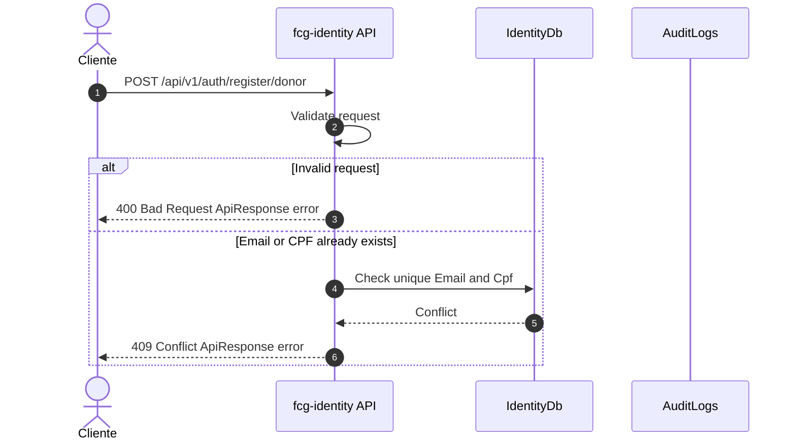
```mermaid
sequenceDiagram
    autonumber
    actor Client as Cliente
    participant IdentityApi as fcg-identity API
    participant IdentityDb as IdentityDb
    participant Audit as AuditLogs

    Client->>IdentityApi: POST /api/v1/auth/register/donor
    IdentityApi->>IdentityApi: Validate request
    alt Invalid request
        IdentityApi-->>Client: 400 Bad Request ApiResponse error
    else Email or CPF already exists
        IdentityApi->>IdentityDb: Check unique Email and Cpf
        IdentityDb-->>IdentityApi: Conflict
        IdentityApi-->>Client: 409 Conflict ApiResponse error
    end
```

### POST /api/v1/auth/login

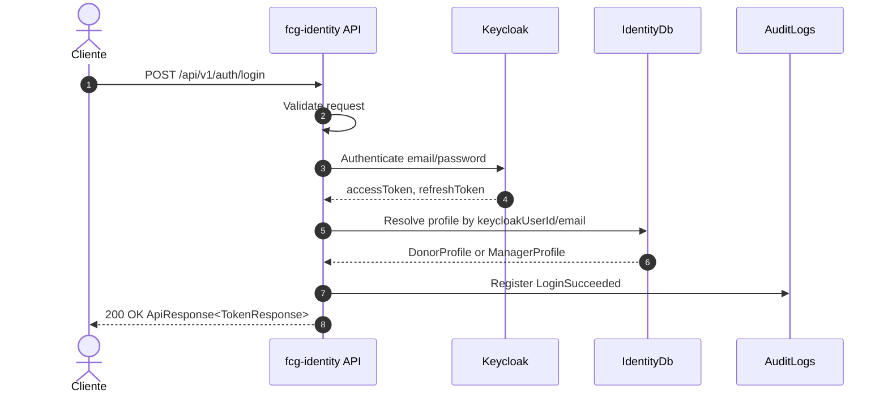
```mermaid
sequenceDiagram
    autonumber
    actor Client as Cliente
    participant IdentityApi as fcg-identity API
    participant Keycloak as Keycloak
    participant IdentityDb as IdentityDb
    participant Audit as AuditLogs

    Client->>IdentityApi: POST /api/v1/auth/login
    IdentityApi->>IdentityApi: Validate request
    IdentityApi->>Keycloak: Authenticate email/password
    Keycloak-->>IdentityApi: accessToken, refreshToken
    IdentityApi->>IdentityDb: Resolve profile by keycloakUserId/email
    IdentityDb-->>IdentityApi: DonorProfile or ManagerProfile
    IdentityApi->>Audit: Register LoginSucceeded
    IdentityApi-->>Client: 200 OK ApiResponse<TokenResponse>
```

Falhas principais:

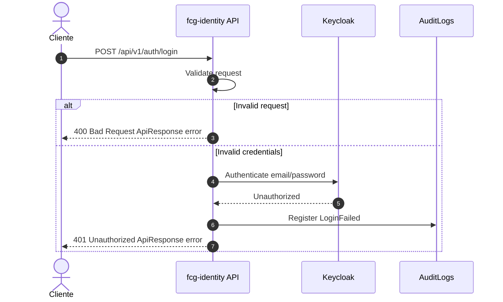
```mermaid
sequenceDiagram
    autonumber
    actor Client as Cliente
    participant IdentityApi as fcg-identity API
    participant Keycloak as Keycloak
    participant Audit as AuditLogs

    Client->>IdentityApi: POST /api/v1/auth/login
    IdentityApi->>IdentityApi: Validate request
    alt Invalid request
        IdentityApi-->>Client: 400 Bad Request ApiResponse error
    else Invalid credentials
        IdentityApi->>Keycloak: Authenticate email/password
        Keycloak-->>IdentityApi: Unauthorized
        IdentityApi->>Audit: Register LoginFailed
        IdentityApi-->>Client: 401 Unauthorized ApiResponse error
    end
```

### POST /api/v1/auth/refresh

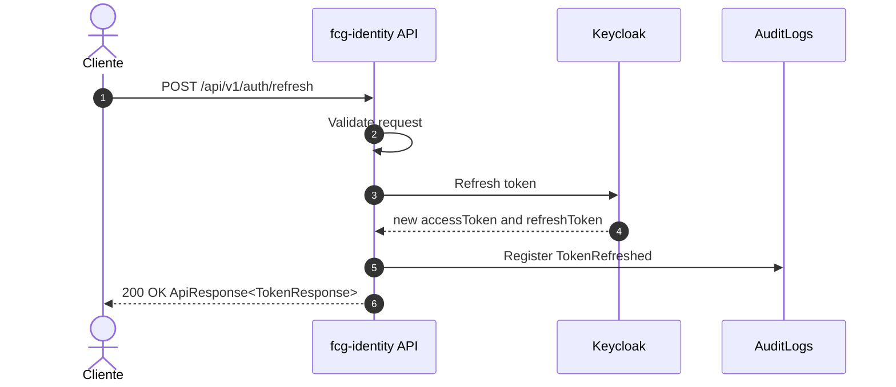
```mermaid
sequenceDiagram
    autonumber
    actor Client as Cliente
    participant IdentityApi as fcg-identity API
    participant Keycloak as Keycloak
    participant Audit as AuditLogs

    Client->>IdentityApi: POST /api/v1/auth/refresh
    IdentityApi->>IdentityApi: Validate request
    IdentityApi->>Keycloak: Refresh token
    Keycloak-->>IdentityApi: new accessToken and refreshToken
    IdentityApi->>Audit: Register TokenRefreshed
    IdentityApi-->>Client: 200 OK ApiResponse<TokenResponse>
```

Falhas principais:

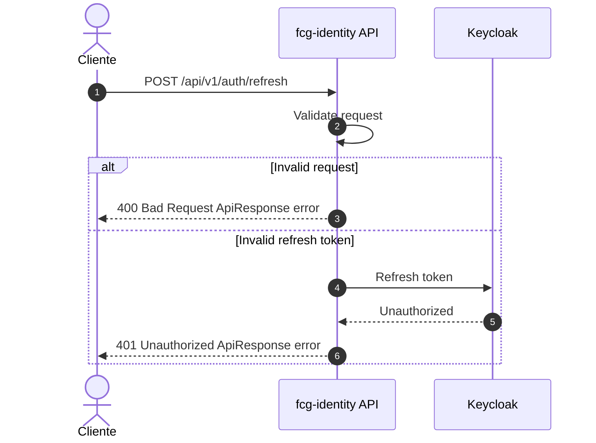
```mermaid
sequenceDiagram
    autonumber
    actor Client as Cliente
    participant IdentityApi as fcg-identity API
    participant Keycloak as Keycloak

    Client->>IdentityApi: POST /api/v1/auth/refresh
    IdentityApi->>IdentityApi: Validate request
    alt Invalid request
        IdentityApi-->>Client: 400 Bad Request ApiResponse error
    else Invalid refresh token
        IdentityApi->>Keycloak: Refresh token
        Keycloak-->>IdentityApi: Unauthorized
        IdentityApi-->>Client: 401 Unauthorized ApiResponse error
    end
```

### GET /api/v1/me

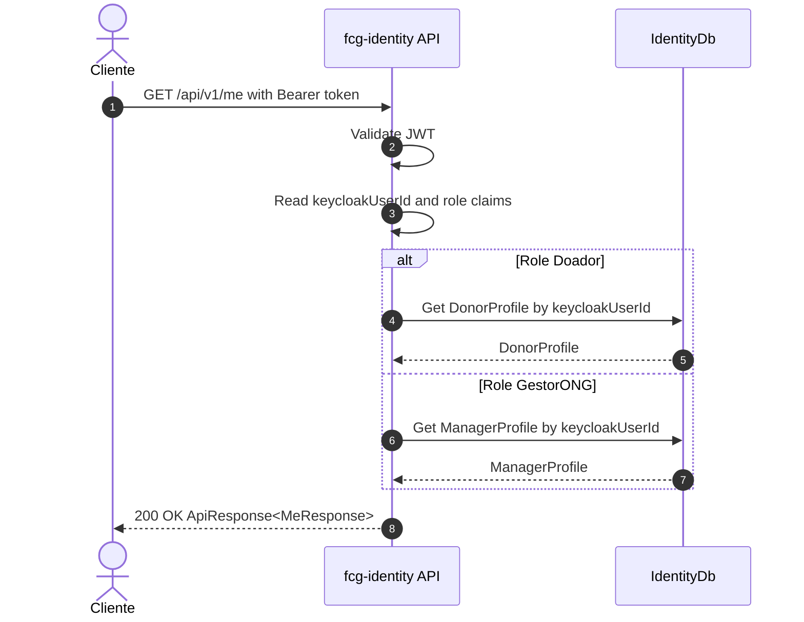
```mermaid
sequenceDiagram
    autonumber
    actor Client as Cliente
    participant IdentityApi as fcg-identity API
    participant IdentityDb as IdentityDb

    Client->>IdentityApi: GET /api/v1/me with Bearer token
    IdentityApi->>IdentityApi: Validate JWT
    IdentityApi->>IdentityApi: Read keycloakUserId and role claims
    alt Role Doador
        IdentityApi->>IdentityDb: Get DonorProfile by keycloakUserId
        IdentityDb-->>IdentityApi: DonorProfile
    else Role GestorONG
        IdentityApi->>IdentityDb: Get ManagerProfile by keycloakUserId
        IdentityDb-->>IdentityApi: ManagerProfile
    end
    IdentityApi-->>Client: 200 OK ApiResponse<MeResponse>
```

Falhas principais:

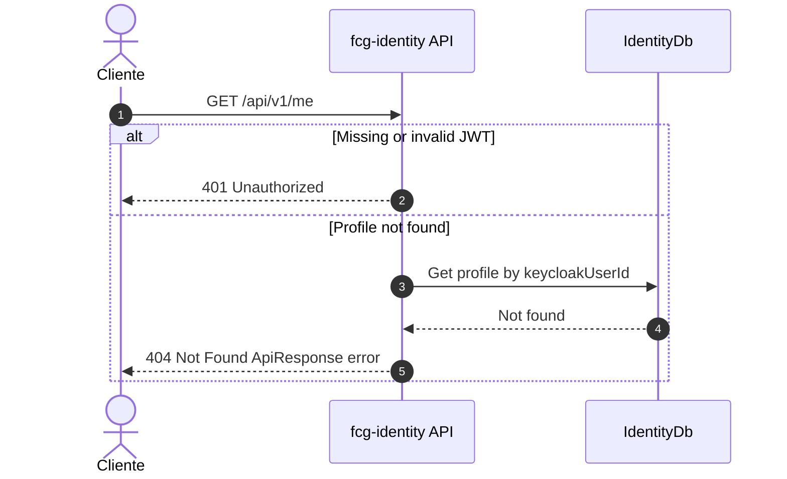
```mermaid
sequenceDiagram
    autonumber
    actor Client as Cliente
    participant IdentityApi as fcg-identity API
    participant IdentityDb as IdentityDb

    Client->>IdentityApi: GET /api/v1/me
    alt Missing or invalid JWT
        IdentityApi-->>Client: 401 Unauthorized
    else Profile not found
        IdentityApi->>IdentityDb: Get profile by keycloakUserId
        IdentityDb-->>IdentityApi: Not found
        IdentityApi-->>Client: 404 Not Found ApiResponse error
    end
```

## fcg-campaigns

### POST /api/v1/campaigns

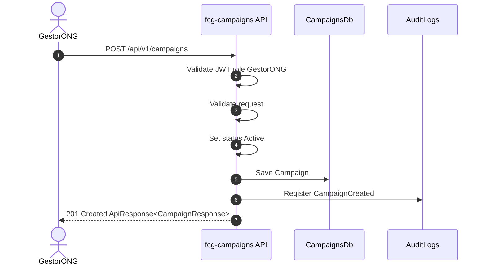
```mermaid
sequenceDiagram
    autonumber
    actor Manager as GestorONG
    participant CampaignsApi as fcg-campaigns API
    participant CampaignsDb as CampaignsDb
    participant Audit as AuditLogs

    Manager->>CampaignsApi: POST /api/v1/campaigns
    CampaignsApi->>CampaignsApi: Validate JWT role GestorONG
    CampaignsApi->>CampaignsApi: Validate request
    CampaignsApi->>CampaignsApi: Set status Active
    CampaignsApi->>CampaignsDb: Save Campaign
    CampaignsApi->>Audit: Register CampaignCreated
    CampaignsApi-->>Manager: 201 Created ApiResponse<CampaignResponse>
```

Falhas principais:

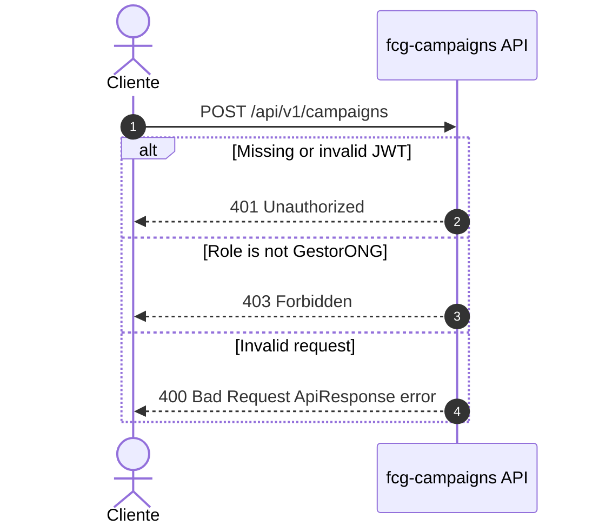
```mermaid
sequenceDiagram
    autonumber
    actor Client as Cliente
    participant CampaignsApi as fcg-campaigns API

    Client->>CampaignsApi: POST /api/v1/campaigns
    alt Missing or invalid JWT
        CampaignsApi-->>Client: 401 Unauthorized
    else Role is not GestorONG
        CampaignsApi-->>Client: 403 Forbidden
    else Invalid request
        CampaignsApi-->>Client: 400 Bad Request ApiResponse error
    end
```

### PUT /api/v1/campaigns/{id}

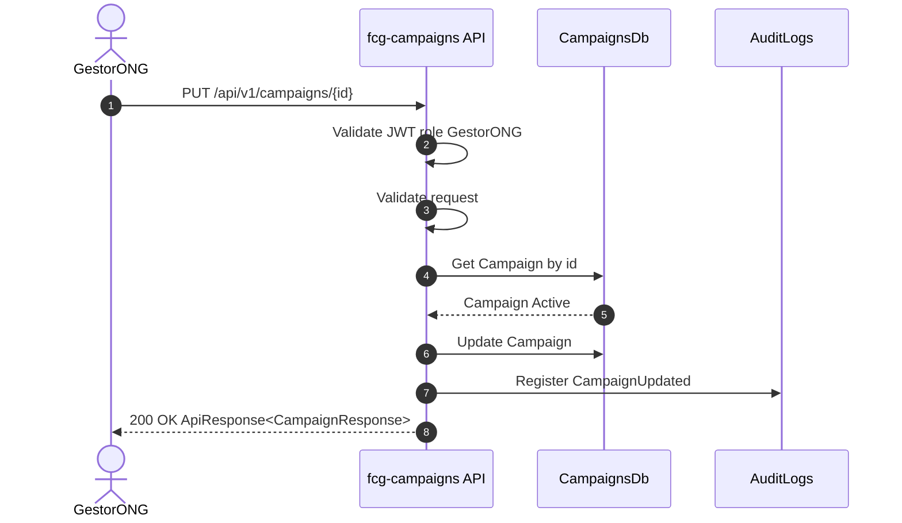
```mermaid
sequenceDiagram
    autonumber
    actor Manager as GestorONG
    participant CampaignsApi as fcg-campaigns API
    participant CampaignsDb as CampaignsDb
    participant Audit as AuditLogs

    Manager->>CampaignsApi: PUT /api/v1/campaigns/{id}
    CampaignsApi->>CampaignsApi: Validate JWT role GestorONG
    CampaignsApi->>CampaignsApi: Validate request
    CampaignsApi->>CampaignsDb: Get Campaign by id
    CampaignsDb-->>CampaignsApi: Campaign Active
    CampaignsApi->>CampaignsDb: Update Campaign
    CampaignsApi->>Audit: Register CampaignUpdated
    CampaignsApi-->>Manager: 200 OK ApiResponse<CampaignResponse>
```

Falhas principais:

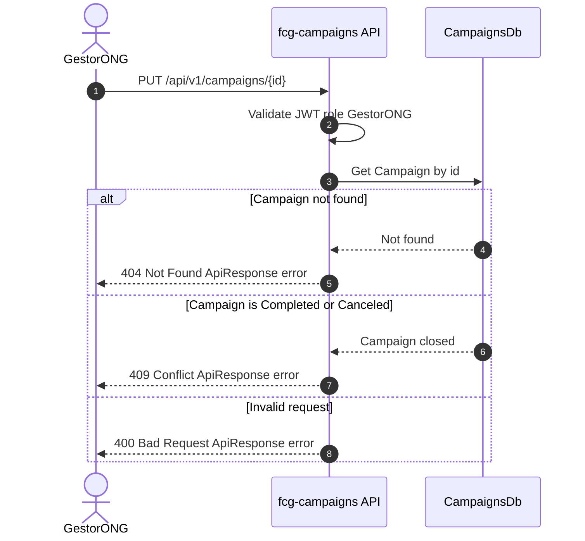
```mermaid
sequenceDiagram
    autonumber
    actor Manager as GestorONG
    participant CampaignsApi as fcg-campaigns API
    participant CampaignsDb as CampaignsDb

    Manager->>CampaignsApi: PUT /api/v1/campaigns/{id}
    CampaignsApi->>CampaignsApi: Validate JWT role GestorONG
    CampaignsApi->>CampaignsDb: Get Campaign by id
    alt Campaign not found
        CampaignsDb-->>CampaignsApi: Not found
        CampaignsApi-->>Manager: 404 Not Found ApiResponse error
    else Campaign is Completed or Canceled
        CampaignsDb-->>CampaignsApi: Campaign closed
        CampaignsApi-->>Manager: 409 Conflict ApiResponse error
    else Invalid request
        CampaignsApi-->>Manager: 400 Bad Request ApiResponse error
    end
```

### PATCH /api/v1/campaigns/{id}/status

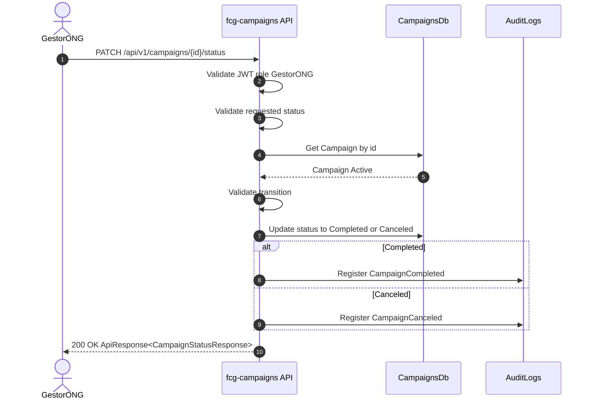
```mermaid
sequenceDiagram
    autonumber
    actor Manager as GestorONG
    participant CampaignsApi as fcg-campaigns API
    participant CampaignsDb as CampaignsDb
    participant Audit as AuditLogs

    Manager->>CampaignsApi: PATCH /api/v1/campaigns/{id}/status
    CampaignsApi->>CampaignsApi: Validate JWT role GestorONG
    CampaignsApi->>CampaignsApi: Validate requested status
    CampaignsApi->>CampaignsDb: Get Campaign by id
    CampaignsDb-->>CampaignsApi: Campaign Active
    CampaignsApi->>CampaignsApi: Validate transition
    CampaignsApi->>CampaignsDb: Update status to Completed or Canceled
    alt Completed
        CampaignsApi->>Audit: Register CampaignCompleted
    else Canceled
        CampaignsApi->>Audit: Register CampaignCanceled
    end
    CampaignsApi-->>Manager: 200 OK ApiResponse<CampaignStatusResponse>
```

Falhas principais:

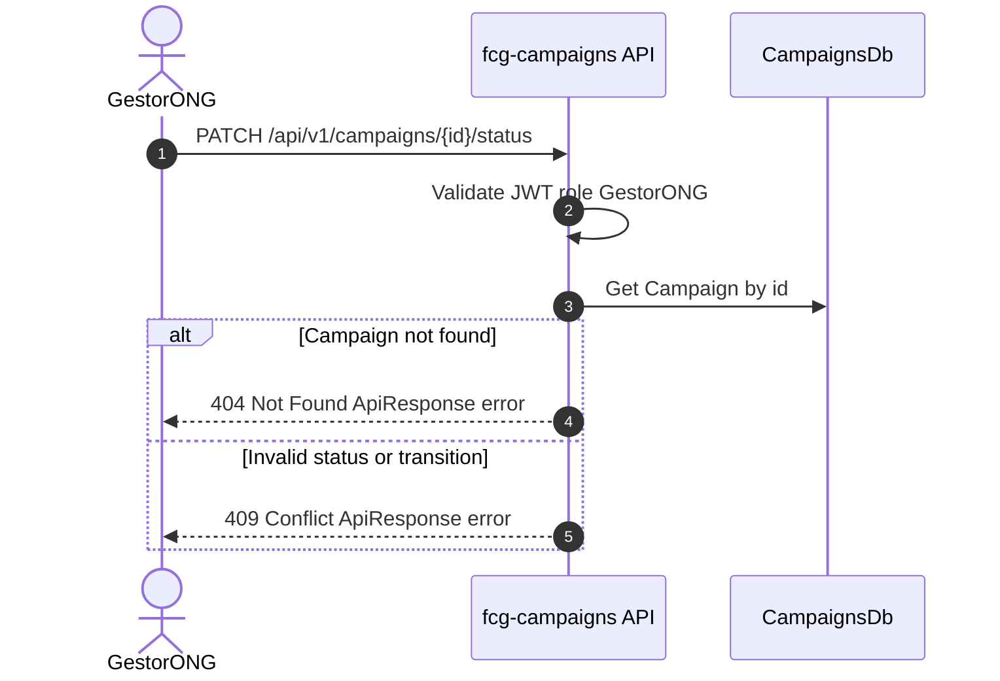
```mermaid
sequenceDiagram
    autonumber
    actor Manager as GestorONG
    participant CampaignsApi as fcg-campaigns API
    participant CampaignsDb as CampaignsDb

    Manager->>CampaignsApi: PATCH /api/v1/campaigns/{id}/status
    CampaignsApi->>CampaignsApi: Validate JWT role GestorONG
    CampaignsApi->>CampaignsDb: Get Campaign by id
    alt Campaign not found
        CampaignsApi-->>Manager: 404 Not Found ApiResponse error
    else Invalid status or transition
        CampaignsApi-->>Manager: 409 Conflict ApiResponse error
    end
```

### GET /api/v1/campaigns

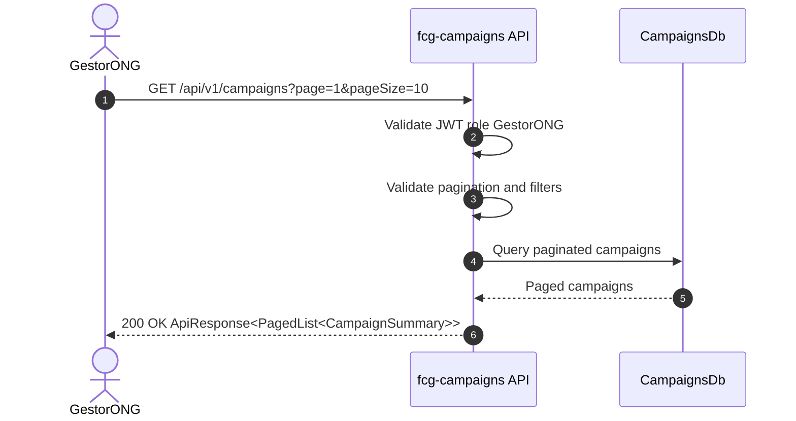
```mermaid
sequenceDiagram
    autonumber
    actor Manager as GestorONG
    participant CampaignsApi as fcg-campaigns API
    participant CampaignsDb as CampaignsDb

    Manager->>CampaignsApi: GET /api/v1/campaigns?page=1&pageSize=10
    CampaignsApi->>CampaignsApi: Validate JWT role GestorONG
    CampaignsApi->>CampaignsApi: Validate pagination and filters
    CampaignsApi->>CampaignsDb: Query paginated campaigns
    CampaignsDb-->>CampaignsApi: Paged campaigns
    CampaignsApi-->>Manager: 200 OK ApiResponse<PagedList<CampaignSummary>>
```

### GET /api/v1/campaigns/{id}

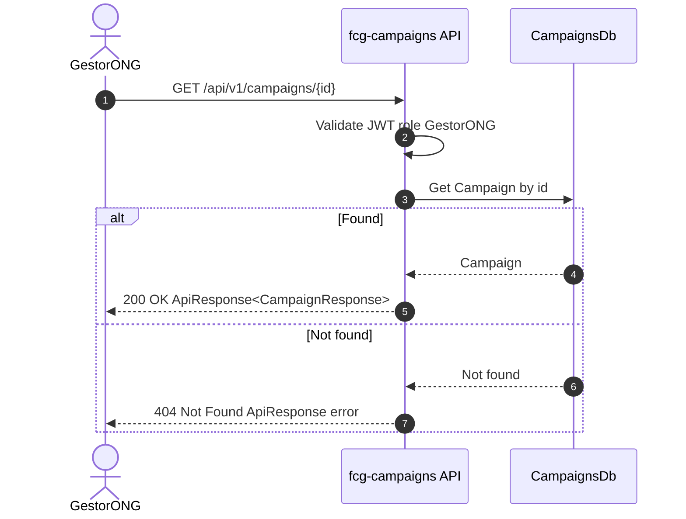
```mermaid
sequenceDiagram
    autonumber
    actor Manager as GestorONG
    participant CampaignsApi as fcg-campaigns API
    participant CampaignsDb as CampaignsDb

    Manager->>CampaignsApi: GET /api/v1/campaigns/{id}
    CampaignsApi->>CampaignsApi: Validate JWT role GestorONG
    CampaignsApi->>CampaignsDb: Get Campaign by id
    alt Found
        CampaignsDb-->>CampaignsApi: Campaign
        CampaignsApi-->>Manager: 200 OK ApiResponse<CampaignResponse>
    else Not found
        CampaignsDb-->>CampaignsApi: Not found
        CampaignsApi-->>Manager: 404 Not Found ApiResponse error
    end
```

### GET /api/v1/transparency/campaigns

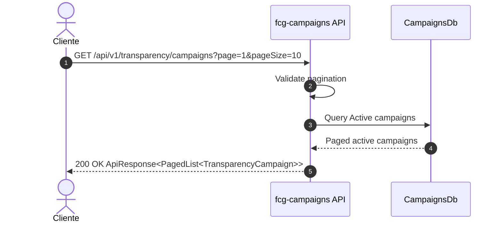
```mermaid
sequenceDiagram
    autonumber
    actor Client as Cliente
    participant CampaignsApi as fcg-campaigns API
    participant CampaignsDb as CampaignsDb

    Client->>CampaignsApi: GET /api/v1/transparency/campaigns?page=1&pageSize=10
    CampaignsApi->>CampaignsApi: Validate pagination
    CampaignsApi->>CampaignsDb: Query Active campaigns
    CampaignsDb-->>CampaignsApi: Paged active campaigns
    CampaignsApi-->>Client: 200 OK ApiResponse<PagedList<TransparencyCampaign>>
```

### GET /internal/campaigns/{id}/donation-eligibility

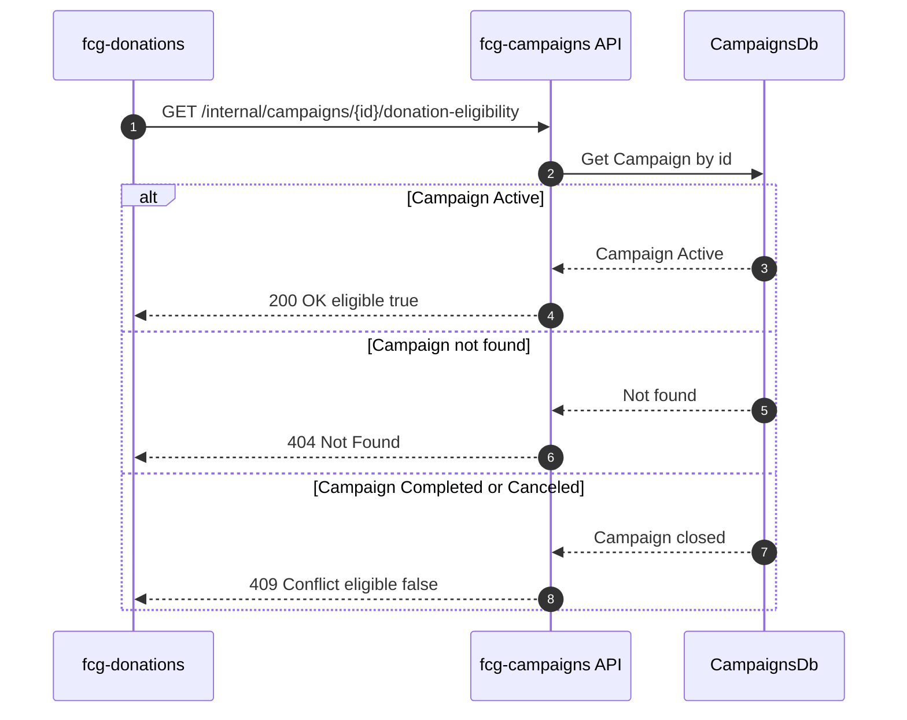
```mermaid
sequenceDiagram
    autonumber
    participant DonationsApi as fcg-donations
    participant CampaignsApi as fcg-campaigns API
    participant CampaignsDb as CampaignsDb

    DonationsApi->>CampaignsApi: GET /internal/campaigns/{id}/donation-eligibility
    CampaignsApi->>CampaignsDb: Get Campaign by id
    alt Campaign Active
        CampaignsDb-->>CampaignsApi: Campaign Active
        CampaignsApi-->>DonationsApi: 200 OK eligible true
    else Campaign not found
        CampaignsDb-->>CampaignsApi: Not found
        CampaignsApi-->>DonationsApi: 404 Not Found
    else Campaign Completed or Canceled
        CampaignsDb-->>CampaignsApi: Campaign closed
        CampaignsApi-->>DonationsApi: 409 Conflict eligible false
    end
```

### POST /internal/campaigns/{id}/donation-processed

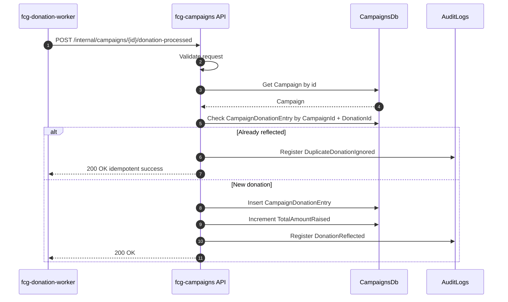
```mermaid
sequenceDiagram
    autonumber
    participant Worker as fcg-donation-worker
    participant CampaignsApi as fcg-campaigns API
    participant CampaignsDb as CampaignsDb
    participant Audit as AuditLogs

    Worker->>CampaignsApi: POST /internal/campaigns/{id}/donation-processed
    CampaignsApi->>CampaignsApi: Validate request
    CampaignsApi->>CampaignsDb: Get Campaign by id
    CampaignsDb-->>CampaignsApi: Campaign
    CampaignsApi->>CampaignsDb: Check CampaignDonationEntry by CampaignId + DonationId
    alt Already reflected
        CampaignsApi->>Audit: Register DuplicateDonationIgnored
        CampaignsApi-->>Worker: 200 OK idempotent success
    else New donation
        CampaignsApi->>CampaignsDb: Insert CampaignDonationEntry
        CampaignsApi->>CampaignsDb: Increment TotalAmountRaised
        CampaignsApi->>Audit: Register DonationReflected
        CampaignsApi-->>Worker: 200 OK
    end
```

## fcg-donations

### POST /api/v1/donations

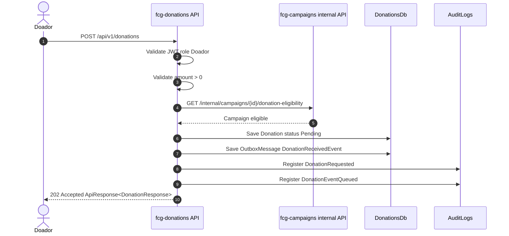
```mermaid
sequenceDiagram
    autonumber
    actor Donor as Doador
    participant DonationsApi as fcg-donations API
    participant CampaignsApi as fcg-campaigns internal API
    participant DonationsDb as DonationsDb
    participant Audit as AuditLogs

    Donor->>DonationsApi: POST /api/v1/donations
    DonationsApi->>DonationsApi: Validate JWT role Doador
    DonationsApi->>DonationsApi: Validate amount > 0
    DonationsApi->>CampaignsApi: GET /internal/campaigns/{id}/donation-eligibility
    CampaignsApi-->>DonationsApi: Campaign eligible
    DonationsApi->>DonationsDb: Save Donation status Pending
    DonationsApi->>DonationsDb: Save OutboxMessage DonationReceivedEvent
    DonationsApi->>Audit: Register DonationRequested
    DonationsApi->>Audit: Register DonationEventQueued
    DonationsApi-->>Donor: 202 Accepted ApiResponse<DonationResponse>
```

Falhas principais:

```mermaid
sequenceDiagram
    autonumber
    actor Client as Cliente
    participant DonationsApi as fcg-donations API
    participant CampaignsApi as fcg-campaigns internal API
    participant Audit as AuditLogs

    Client->>DonationsApi: POST /api/v1/donations
    alt Missing or invalid JWT
        DonationsApi-->>Client: 401 Unauthorized
    else Role is not Doador
        DonationsApi-->>Client: 403 Forbidden
    else Invalid amount
        DonationsApi->>Audit: Register DonationRejected
        DonationsApi-->>Client: 400 Bad Request ApiResponse error
    else Campaign not found
        DonationsApi->>CampaignsApi: GET /internal/campaigns/{id}/donation-eligibility
        CampaignsApi-->>DonationsApi: 404 Not Found
        DonationsApi->>Audit: Register DonationRejected
        DonationsApi-->>Client: 404 Not Found ApiResponse error
    else Campaign closed
        DonationsApi->>CampaignsApi: GET /internal/campaigns/{id}/donation-eligibility
        CampaignsApi-->>DonationsApi: 409 Conflict
        DonationsApi->>Audit: Register DonationRejected
        DonationsApi-->>Client: 409 Conflict ApiResponse error
    else Campaign service unavailable
        DonationsApi->>CampaignsApi: GET /internal/campaigns/{id}/donation-eligibility with Polly
        CampaignsApi--x DonationsApi: Timeout or unavailable
        DonationsApi->>Audit: Register DonationRejected
        DonationsApi-->>Client: 503 Service Unavailable ApiResponse error
    end
```

### GET /api/v1/donations

```mermaid
sequenceDiagram
    autonumber
    actor User as Doador or GestorONG
    participant DonationsApi as fcg-donations API
    participant DonationsDb as DonationsDb

    User->>DonationsApi: GET /api/v1/donations?page=1&pageSize=10
    DonationsApi->>DonationsApi: Validate JWT
    DonationsApi->>DonationsApi: Validate pagination and filters
    alt Role Doador
        DonationsApi->>DonationsDb: Query donations by DonorId
    else Role GestorONG
        DonationsApi->>DonationsDb: Query all donations
    end
    DonationsDb-->>DonationsApi: Paged donations
    DonationsApi-->>User: 200 OK ApiResponse<PagedList<DonationSummary>>
```

Falhas principais:

```mermaid
sequenceDiagram
    autonumber
    actor Client as Cliente
    participant DonationsApi as fcg-donations API

    Client->>DonationsApi: GET /api/v1/donations
    alt Missing or invalid JWT
        DonationsApi-->>Client: 401 Unauthorized
    else Role is not Doador or GestorONG
        DonationsApi-->>Client: 403 Forbidden
    else Invalid pagination
        DonationsApi-->>Client: 400 Bad Request ApiResponse error
    end
```

### GET /api/v1/donations/{id}

```mermaid
sequenceDiagram
    autonumber
    actor User as Doador or GestorONG
    participant DonationsApi as fcg-donations API
    participant DonationsDb as DonationsDb

    User->>DonationsApi: GET /api/v1/donations/{id}
    DonationsApi->>DonationsApi: Validate JWT
    DonationsApi->>DonationsDb: Get Donation by id
    alt Not found
        DonationsDb-->>DonationsApi: Not found
        DonationsApi-->>User: 404 Not Found ApiResponse error
    else Role Doador and owns donation
        DonationsDb-->>DonationsApi: Donation
        DonationsApi-->>User: 200 OK ApiResponse<DonationResponse>
    else Role Doador and does not own donation
        DonationsDb-->>DonationsApi: Donation from another donor
        DonationsApi-->>User: 404 Not Found ApiResponse error
    else Role GestorONG
        DonationsDb-->>DonationsApi: Donation
        DonationsApi-->>User: 200 OK ApiResponse<DonationResponse>
    end
```

### Outbox Publisher

```mermaid
sequenceDiagram
    autonumber
    participant Publisher as Outbox Publisher
    participant DonationsDb as DonationsDb
    participant Kafka as Kafka donation-received
    participant Audit as AuditLogs

    Publisher->>DonationsDb: Read Pending OutboxMessages
    DonationsDb-->>Publisher: Pending messages
    loop For each message
        Publisher->>Kafka: Publish DonationReceivedEvent
        Kafka-->>Publisher: Ack
        Publisher->>DonationsDb: Mark OutboxMessage Published
        Publisher->>Audit: Register DonationEventPublished
    end
```

Falhas principais:

```mermaid
sequenceDiagram
    autonumber
    participant Publisher as Outbox Publisher
    participant DonationsDb as DonationsDb
    participant Kafka as Kafka donation-received

    Publisher->>DonationsDb: Read Pending OutboxMessages
    Publisher->>Kafka: Publish DonationReceivedEvent
    alt Kafka publish fails
        Kafka--x Publisher: Error
        Publisher->>DonationsDb: Increment RetryCount and LastError
    else Retry limit reached
        Publisher->>DonationsDb: Mark OutboxMessage Failed
    end
```

## fcg-donation-worker

### Consume Kafka topic donation-received

```mermaid
sequenceDiagram
    autonumber
    participant Kafka as Kafka donation-received
    participant Worker as fcg-donation-worker
    participant DonationsDb as DonationsDb
    participant CampaignsApi as fcg-campaigns internal API
    participant Audit as AuditLogs

    Worker->>Kafka: Consume DonationReceivedEvent
    Worker->>DonationsDb: Check ProcessedMessages by eventId + topic
    DonationsDb-->>Worker: Not processed
    Worker->>DonationsDb: Get Donation by donationId
    DonationsDb-->>Worker: Donation Pending
    Worker->>CampaignsApi: POST /internal/campaigns/{id}/donation-processed
    CampaignsApi-->>Worker: 200 OK
    Worker->>DonationsDb: Insert ProcessedMessage
    Worker->>DonationsDb: Update Donation status Processed
    Worker->>Audit: Register DonationProcessed
```

Falhas e idempotencia:

```mermaid
sequenceDiagram
    autonumber
    participant Kafka as Kafka donation-received
    participant Worker as fcg-donation-worker
    participant DonationsDb as DonationsDb
    participant CampaignsApi as fcg-campaigns internal API
    participant Audit as AuditLogs

    Worker->>Kafka: Consume DonationReceivedEvent
    Worker->>DonationsDb: Check ProcessedMessages by eventId + topic
    alt Already processed
        DonationsDb-->>Worker: ProcessedMessage exists
        Worker->>Audit: Register DuplicateMessageIgnored
    else Campaign update fails permanently
        Worker->>CampaignsApi: POST /internal/campaigns/{id}/donation-processed
        CampaignsApi--x Worker: Error after retries
        Worker->>DonationsDb: Update Donation status Failed with FailureReason
        Worker->>Audit: Register DonationFailed
    else Donation not found or invalid state
        Worker->>DonationsDb: Get Donation by donationId
        DonationsDb-->>Worker: Not found or not Pending
        Worker->>Audit: Register DonationFailed
    end
```
