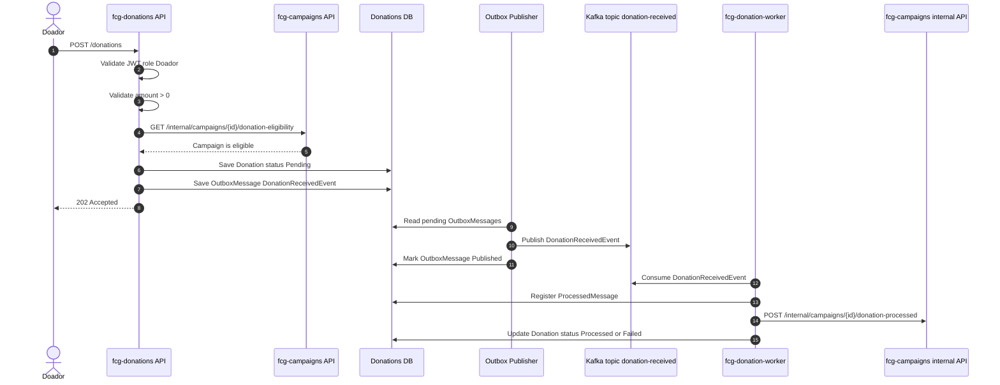

# Fluxo da fcg-donations

A `fcg-donations` recebe intencoes de doacao de um **Doador** autenticado, valida a elegibilidade da campanha na `fcg-campaigns`, persiste a doacao como pendente e usa outbox para publicar o evento `DonationReceivedEvent` no Kafka.

## Entidades

### Donation

Representa a intencao de doacao aceita pela API.

- `Id`
- `CampaignId`
- `DonorId`
- `Amount`
- `Status`: `Pending`, `Processed`, `Failed`
- `CreatedAt`
- `ProcessedAt`
- `FailureReason`

### OutboxMessage

Representa uma mensagem pendente de publicacao no Kafka.

- `Id`
- `AggregateId`
- `EventType`
- `Payload`
- `Status`: `Pending`, `Published`, `Failed`
- `CreatedAt`
- `PublishedAt`
- `RetryCount`
- `LastError`

### ProcessedMessage

Representa uma mensagem ja tratada por um consumidor para apoiar idempotencia.

- `Id`
- `MessageId`
- `Topic`
- `ProcessedAt`

## Fluxo principal



## Evento publicado

Topic:

```text
donation-received
```

Event:

```text
DonationReceivedEvent
```

Payload minimo:

```json
{
  "eventId": "uuid",
  "donationId": "uuid",
  "campaignId": "uuid",
  "donorId": "uuid",
  "amount": 100.00,
  "occurredAt": "2026-05-18T20:00:00Z"
}
```

## Regras confirmadas

- Apenas `Doador` autenticado pode criar uma intencao de doacao.
- `Amount` deve ser maior que zero.
- A campanha precisa estar apta a receber doacao, validada pela `fcg-campaigns` via HTTP com Refit e Polly.
- A `fcg-donations` nao atualiza `ValorTotalArrecadado`.
- A publicacao no Kafka usa outbox para evitar perda de evento apos persistir a doacao.
- A `fcg-donation-worker` atualiza o status da `Donation` para `Processed` ou `Failed` apos consumir o evento.
- A `fcg-donation-worker` nao escreve diretamente no banco da `fcg-campaigns`; ela chama uma API interna da `fcg-campaigns` para refletir o valor arrecadado.
- `DonorId` referencia o `DonorProfile` da `fcg-identity` sem foreign key para o `IdentityDb`.
