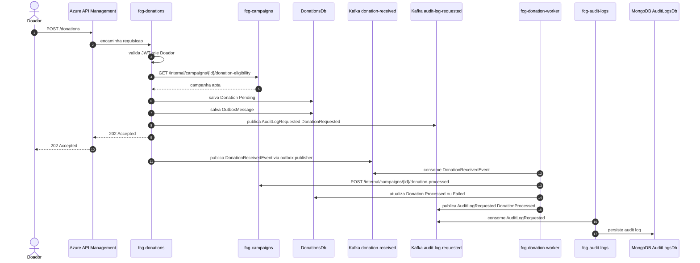

# Overview da Arquitetura

Este documento consolida a arquitetura da fase 5 da plataforma **Conexao Solidaria**. Ele aponta para os documentos detalhados e ADRs que registram as decisoes ja confirmadas.

## Objetivo do MVP

A plataforma atende a ONG **Esperanca Solidaria** com um MVP para gestao de campanhas, cadastro de doadores, transparencia publica e processamento assincrono de doacoes.

Focos arquiteturais:

- escalabilidade por microsservicos
- observabilidade com metricas reais
- automacao por CI/CD e infraestrutura como codigo
- seguranca com Keycloak, JWT e RBAC

## Aplicacoes

Aplicacoes confirmadas:

```text
fcg-identity
fcg-campaigns
fcg-donations
fcg-donation-worker
fcg-audit-logs
fcg-solidarity-web
fcg-solidarity-infra
```

Responsabilidades:

- `fcg-identity`: fachada de identidade da aplicacao, integrando com Keycloak e mantendo perfis de dominio.
- `fcg-campaigns`: administracao de campanhas, painel de transparencia e atualizacao idempotente do valor arrecadado.
- `fcg-donations`: recebimento de intencoes de doacao e publicacao de eventos no Kafka.
- `fcg-donation-worker`: consumo de eventos de doacao, processamento, atualizacao de status da doacao e notificacao da `fcg-campaigns`.
- `fcg-audit-logs`: consumo de eventos de auditoria do Kafka e persistencia em MongoDB.
- `fcg-solidarity-web`: interface web da plataforma.
- `fcg-solidarity-infra`: infraestrutura compartilhada, ambiente integrado, Kubernetes, observabilidade e Terraform Azure.

Referencia: [ADR 0002](../adr/0002-service-boundaries-for-campaigns-and-donations.md), [ADR 0013](../adr/0013-use-separate-repositories.md).

## Repositorios

Cada aplicacao tera seu proprio repositorio. O repositorio `fcg-solidarity-infra` concentrara o ambiente integrado e recursos compartilhados.

```text
fcg-identity
fcg-campaigns
fcg-donations
fcg-donation-worker
fcg-audit-logs
fcg-solidarity-web
fcg-solidarity-infra
```

Cada repositorio de aplicacao deve conter:

- `Dockerfile`
- `docker-compose` local da aplicacao
- manifests Kubernetes do proprio servico
- wrappers de CI/CD chamando o `fcg-pipelines`
- README do componente

O `fcg-solidarity-infra` deve conter:

- docker compose integrado
- manifests Kubernetes integrados
- configuracoes de Keycloak, Kafka, Kafka UI, MongoDB, Prometheus e Grafana
- dashboards do Grafana
- Terraform para Azure
- README do ambiente completo

Referencia: [repositorios e infraestrutura](./repositories-and-infra.md).

## Identidade e Acesso

O Keycloak sera o provedor de identidade para credenciais, hash de senha, emissao de JWT e roles. O cliente nao chamara o Keycloak diretamente; ele chamara a `fcg-identity`.

Roles canonicas:

```text
GestorONG
Doador
```

Fluxos principais:

```text
Cliente -> fcg-identity -> Keycloak
Cliente -> APIs com JWT emitido pelo Keycloak
APIs -> validam JWT e RBAC internamente
```

Endpoints minimos da `fcg-identity`:

```text
POST /auth/register/donor
POST /auth/login
POST /auth/refresh
GET  /me
```

O **Doador** e cadastrado publicamente pela `fcg-identity`. O **GestorONG** e provisionado por seed da `fcg-identity`, criando ou encontrando o usuario no Keycloak e sincronizando o `ManagerProfile` no `IdentityDb`.

Referencia: [modelo da fcg-identity](./fcg-identity-model.md), [ADR 0001](../adr/0001-keycloak-behind-identity-api.md), [ADR 0003](../adr/0003-provision-gestorong-in-keycloak.md), [ADR 0004](../adr/0004-register-doador-through-identity-api.md).

## Campanhas

A `fcg-campaigns` e dona das campanhas e do painel publico de transparencia.

Responsabilidades:

- criar, editar, concluir e cancelar campanhas
- proteger endpoints administrativos com role `GestorONG`
- listar campanhas ativas no painel de transparencia
- validar se uma campanha esta apta a receber doacao
- refletir doacoes processadas de forma idempotente

Entidades confirmadas:

```text
Campaign
CampaignDonationEntry
```

Referencia: [modelo da fcg-campaigns](./fcg-campaigns-model.md), [ADR 0005](../adr/0005-campaigns-own-campaign-management-and-transparency.md).

## Doacoes

A `fcg-donations` recebe intencoes de doacao de um **Doador** autenticado. Ela valida o valor, consulta a `fcg-campaigns` via HTTP para saber se a campanha pode receber doacao, persiste a doacao como pendente e registra uma mensagem de outbox.

Entidades confirmadas:

```text
Donation
OutboxMessage
ProcessedMessage
```

Evento Kafka:

```text
Topic: donation-received
Event: DonationReceivedEvent
```

Payload minimo:

```json
{
  "eventId": "uuid",
  "donationId": "uuid",
  "campaignId": "uuid",
  "donorId": "uuid",
  "amount": 100.00,
  "occurredAt": "2026-05-18T20:00:00Z"
}
```

Referencia: [fluxo da fcg-donations](./fcg-donations-flow.md), [ADR 0006](../adr/0006-donations-api-receives-donation-intentions.md), [ADR 0007](../adr/0007-validate-campaign-eligibility-over-http.md), [ADR 0008](../adr/0008-use-kafka-for-donation-events.md).

## Worker de Doacoes

A `fcg-donation-worker` consome `DonationReceivedEvent` do Kafka.

Responsabilidades:

- consumir eventos do topico `donation-received`
- registrar mensagem processada para idempotencia
- chamar API interna da `fcg-campaigns` para refletir o valor arrecadado
- atualizar a `Donation` para `Processed` ou `Failed`

O worker nao escreve diretamente no banco da `fcg-campaigns`.

Referencia: [ADR 0009](../adr/0009-worker-updates-donation-status.md), [ADR 0010](../adr/0010-worker-updates-campaigns-through-internal-api.md).

## Auditoria

A auditoria e explicita por eventos de negocio e seguranca. Cada aplicacao decide quais eventos auditar dentro dos seus casos de uso e publica uma mensagem no Kafka.

Topic Kafka:

```text
audit-log-requested
```

Evento:

```text
AuditLogRequestedEvent
```

O `fcg-audit-logs` consome o topico `audit-log-requested`, aplica idempotencia por `eventId` e persiste os registros em MongoDB. Os servicos de negocio nao possuem tabela `AuditLogs` nos seus databases SQL.

Este fluxo de auditoria nao usa outbox. Falhas de publicacao devem ser observadas com logs tecnicos e metricas, mas nao bloqueiam a decisao de manter auditoria fora do banco operacional dos servicos.

Referencia: [ADR 0030](../adr/0030-use-explicit-business-audit-logs.md).

## Bancos de Dados

Banco escolhido:

```text
SQL Server
```

Banco de auditoria:

```text
MongoDB
```

Ambiente local:

```text
SQL Server em container
```

Ambiente Azure:

```text
Banco SQL gerenciado fora do AKS
```

Databases previstos:

```text
IdentityDb
CampaignsDb
DonationsDb
KeycloakDb
AuditLogsDb
```

Cada servico com SQL Server mantem migrations proprias com Entity Framework Core e nao ha foreign keys entre databases de servicos diferentes. O `AuditLogsDb` pertence ao MongoDB e e mantido pelo `fcg-audit-logs`.

Referencia: [ADR 0011](../adr/0011-use-sql-server-for-service-databases.md), [ADR 0012](../adr/0012-use-entity-framework-core.md), [ADR 0016](../adr/0016-use-managed-sql-on-azure.md).

## Mensageria

Broker escolhido:

```text
Kafka
```

O Kafka roda dentro do Kubernetes, tanto local quanto no AKS. O Kafka UI tambem roda no cluster para apoio operacional e demonstracao dos topicos `donation-received` e `audit-log-requested`.

Referencia: [ADR 0008](../adr/0008-use-kafka-for-donation-events.md), [ADR 0018](../adr/0018-run-kafka-inside-kubernetes.md).

## Kubernetes e Azure

Kubernetes local:

```text
Kind
```

Kubernetes Azure:

```text
AKS
```

Imagens:

```text
Azure Container Registry
```

Segredos:

```text
Azure Key Vault
```

Borda publica:

```text
Azure API Management
```

O APIM centraliza as rotas publicas e aplica rate limit. Validacao de JWT e autorizacao RBAC ficam dentro das APIs.

O APIM pode expor todas as rotas de negocio das APIs, inclusive rotas administrativas protegidas por RBAC. Ele nao deve expor:

```text
/internal/*
/metrics
/health
```

Referencia: [ADR 0014](../adr/0014-use-aks-as-azure-kubernetes-target.md), [ADR 0015](../adr/0015-use-acr-for-container-images.md), [ADR 0017](../adr/0017-use-key-vault-for-secrets.md), [ADR 0028](../adr/0028-use-azure-api-management-as-public-edge.md), [ADR 0029](../adr/0029-use-kind-for-local-kubernetes.md).

## Namespaces Kubernetes

Namespaces confirmados:

```text
fcg-identity
fcg-campaigns
fcg-donations
fcg-donation-worker
fcg-audit-logs
fcg-infra
```

Componentes no `fcg-infra`:

```text
Keycloak
Kafka
Kafka UI
MongoDB
Prometheus
Grafana
componentes compartilhados
```

Referencia: [ADR 0026](../adr/0026-use-separated-kubernetes-namespaces.md).

## APIs Internas

Endpoints internos ficam privados dentro do cluster e nao sao publicados no APIM.

Exemplos:

```text
GET  /internal/campaigns/{id}/donation-eligibility
POST /internal/campaigns/{id}/donation-processed
```

Comunicacao service-to-service usa DNS interno do Kubernetes. Clientes HTTP internos usam Refit e Polly quando aplicavel.

Referencia: [ADR 0027](../adr/0027-keep-internal-apis-cluster-private.md).

## Observabilidade

Prometheus e Grafana rodam dentro do Kubernetes. Os servicos .NET usam OpenTelemetry.

Endpoints operacionais:

```text
/health
/metrics
```

Dashboard minimo:

- CPU e memoria dos pods
- contagem de requisicoes HTTP
- status dos pods
- metricas de processamento do worker quando possivel

Referencia: [ADR 0020](../adr/0020-run-prometheus-and-grafana-inside-kubernetes.md), [ADR 0021](../adr/0021-use-opentelemetry-for-service-observability.md).

## CI/CD

A fase 5 reutiliza o padrao da fase 4 com o repositorio `fcg-pipelines`.

Servicos .NET:

```text
dotnet-service-ci.yml
dotnet-service-delivery.yml
branch-name-check.yml
```

Infra:

```text
terraform-azure.yml
```

Gates confirmados:

- branch policy
- secret scan com Gitleaks
- dependency vulnerability scan
- restore e build
- testes
- cobertura minima de 80%
- SonarCloud
- Docker build validation
- build e push da imagem para ACR
- Trivy scan
- deploy no AKS quando habilitado
- healthcheck apos rollout quando URL estiver configurada

O CD segue o padrao do `fcg-users`: dispara por `workflow_run` apos CI bem-sucedido na `main` e tambem por `workflow_dispatch`.

Referencia: [ADR 0022](../adr/0022-reuse-fcg-pipelines-for-ci-cd.md).

## Estrutura Interna .NET

Os servicos .NET usam .NET 8 e seguem a estrutura da fase 4.

Projetos esperados para APIs:

```text
Domain
Application
Infrastructure.SqlServer
WebApi
```

Servicos que usam Kafka adicionam:

```text
Infrastructure.Kafka
```

Servicos que usam MongoDB adicionam:

```text
Infrastructure.MongoDB
```

O worker usa projeto executavel:

```text
Worker
```

Testes:

- APIs: unitarios, integrados, funcionais e utilitarios quando aplicavel.
- APIs: testes integrados tambem cobrem endpoints.
- Worker: unitarios e integrados, sem testes funcionais.
- `fcg-audit-logs`: unitarios e integrados para consumo Kafka, idempotencia e persistencia MongoDB.

Referencia: [estrutura interna .NET](./dotnet-service-structure.md), [ADR 0023](../adr/0023-use-phase-04-dotnet-service-structure.md), [ADR 0024](../adr/0024-use-dotnet-8.md), [ADR 0025](../adr/0025-test-strategy-for-apis-and-worker.md).

## Fluxo de Doacao



## Relacao com Entregaveis do Hackathon

Requisitos cobertos pela arquitetura:

- microsservicos distintos
- JWT e RBAC
- cadastro de doador
- gestao de campanhas por `GestorONG`
- painel publico de transparencia
- fluxo assincrono de doacao via Kafka
- auditoria centralizada via Kafka e MongoDB
- worker processando doacao
- Kubernetes local com Kind e Azure com AKS
- YAMLs de Deployments, Services e ConfigMaps
- Grafana com metricas reais
- CI/CD com build .NET e imagem Docker
- APIM como API Gateway na Azure

Entregaveis que ainda precisam ser produzidos:

- diagrama final de arquitetura
- documento de justificativa do SQL Server e MongoDB
- READMEs passo a passo por repositorio
- README do ambiente integrado no `fcg-solidarity-infra`
- relatorio de entrega com grupo, participantes, links e video
- roteiro do video de ate 15 minutos

## Proximas Frentes

Ordem combinada:

1. Revisar todas as entidades por servico e mapear todas as tabelas.
2. Definir claramente todos os endpoints de cada servico.
3. Adicionar fluxo Mermaid para cada endpoint.
4. Debater e detalhar o frontend separadamente.
