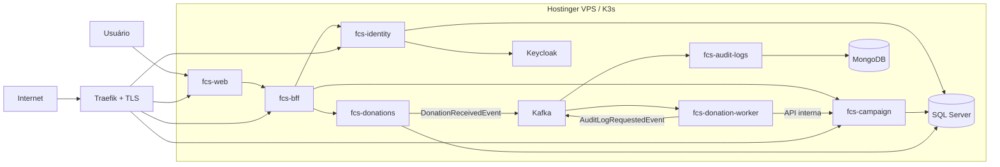

# Arquitetura da plataforma

## Princípios

- APIs públicas entram por Traefik com TLS; endpoints `/internal/*` usam apenas Services e DNS interno do Kubernetes.
- `fcs-donations` registra a intenção e publica o evento; não altera o total da campanha diretamente.
- O worker consome o evento e chama a API interna de campanhas de modo idempotente.
- Terraform administra host, cluster e plataforma compartilhada. Cada aplicação mantém seu Deployment, Service, Ingress e pipeline.
- Secrets ficam no Infisical; manifests e state não recebem valores sensíveis.
